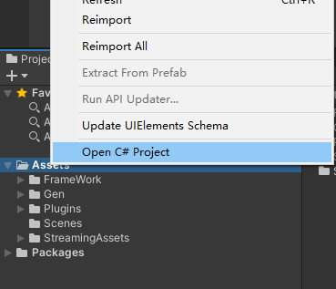
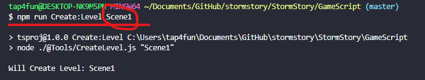
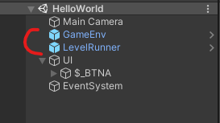
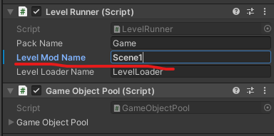
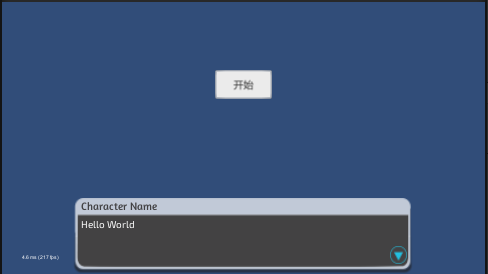

# 程序如何使用

Unity版本： 2019.4 或以上


需要的其他开发环境：

**node.js** [下载地址](http://nodejs.cn/download/)

安装node.js后需要设置  cnpm  

> 你可以使用我们定制的 [cnpm](https://github.com/cnpm/cnpm) (gzip 压缩支持) 命令行工具代替默认的 `npm`:
>
> ```
> $ npm install -g cnpm --registry=https://registry.npm.taobao.org
> ```

还需要安装**typescript**

```
cnpm install -g typescript
```

我们使用**VScode**来编码，所以需要设置Unity的编码工具为Vscode，然后打开项目




---

有两个重要文件夹：**TsProject**和**GameScript**

TsProject是框架使用的，如果不增加框架内容可以不管

GameScript是具体关卡的逻辑代码，一般只关心这个即可


vscode终端进入到GameScript文件夹，通过命令

```shell
npm run Create:Level 关卡名
```

来创建关卡脚本。



已经存在的关卡名不会被创建

---

```typescript
class Scene1 implements IGameLevel {
    name: string;
    root: Transform;
    OnStart(): void {
        Debug.LogWarning("Level Scene1 Start!!!")
    }
    OnUpdate(): void {

    }
    OnFixedUpdate(): void {

    }
    OnDestroy(): void {

    }

}
```

每个关卡都是这样结构

各个函数分别对应Unity的生命周期

一般都是在OnStart()里面编写逻辑

---

常见的api

在GameScript/@types 文件夹里面有定义文件**api.d.ts**

在TsProject文件夹里面运行命令  **npm run build**,就会重新生成框架代码，并且生成定义文件和参考文档

参考文档默认被git忽略，生成后位置和Unity项目平级

最重要的是以**$**开头的一系列函数

这些函数能够查询到以   **$_**   开头命名的物体

比如我在场景里面有一个物体叫  **$_Cube**

那么我使用 

```typescript
let cube = $("Cube")  
```

就能获取到**$_Cube**物体的Transform组件

例如我有一个 按钮 叫 **$_BTNA**

那么我使用

```typescript
let BTNA = $Button("BTNA")  
```

就可以获取到这个按钮组件

Button类型是特殊封装过的

所以使用

```typescript
BTNA.RegClickCallBack("startgame", () => {
            //To do
})
```

来注册点击事件，第一个参数是标签，目前还没用上，第二个是  ()=>{ } 匿名/箭头函数 ，对应c#的Action

我们在匿名函数里写点击后如何执行


！！！！在编辑场景时，选中一个物体，使用快捷键**ctrl + alt + n**  可以快捷添加**$_**前缀

---

对话模块核心是**CreateDialog()** 函数，

这个函数将会创建一个**DialogManager**对象，例如

```typescript
let HelloWorld = CreateDialog()
```

这个对象目前有以下几个函数

```typescript
HelloWorld.Say("Hello World")
HelloWorld.SetCallBack(() => {
    //当整个对话结束后调用
    Debug.Log("Dialog End")  //Debug Vector3 等常用类可以直接使用
})
HelloWorld.WaitForFrames(60) //等待若干帧
HelloWorld.WaitForSeconds(1) //等待若干秒，受游戏速度影响
HelloWorld.WaitForSecondsUnscaled(2) //等待若干秒，不受游戏速度影响
HelloWorld.DoAction(() => {
    //在对话进行过程中执行操作
    Debug.Log("XXXXXXX")
})
HelloWorld.Options([ //第一个参数是 option 对象的数组
    option("选项1", () => {
        HelloWorld.Continue()//继续执行，在暂停对话后用来恢复对话
    }),
    option("选项2", () => {
        Option2Dialog.Start()
    })
], true)//这里参数是指是否暂停后面的语句
HelloWorld.Say("这是  HelloWorld.Continue()  执行后才会运行的语句")
```

这些只是定义了整个对话的流程

但是对话还没有开始，所以在按钮点击里面

```typescript
BTNA.RegClickCallBack("startgame", () => {
    HelloWorld.Start() //Start()是从头开始的意思
})
```

---

代码编写完后，在终端里

输入**npm run build**

这会编译ts代码并复制到Unity项目里面

然后我们来看Unity实际场景如何调用

场景里必需的两个物体



这两个预制体在 **Assets\FrameWork\Resources\Core**

GameEnv可以不用管

LevelRunner需要配置关卡模块名 为之前脚本名称



然后运行，点击按钮



