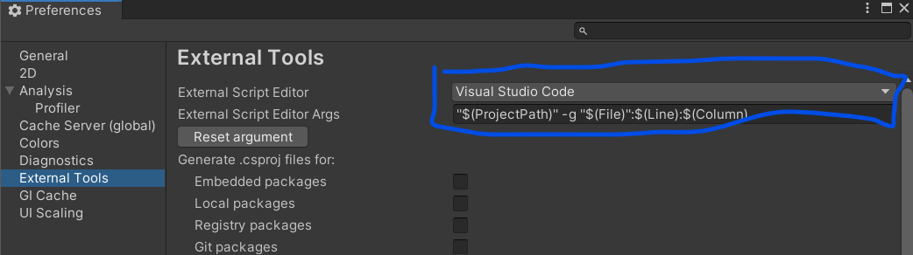
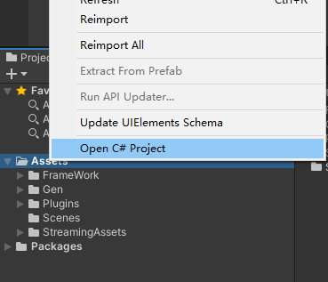
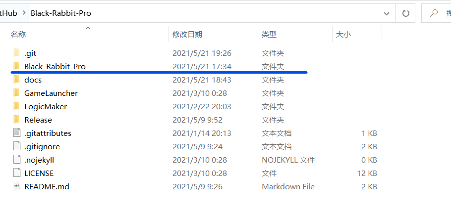
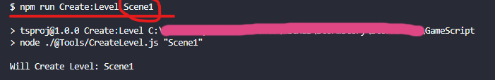
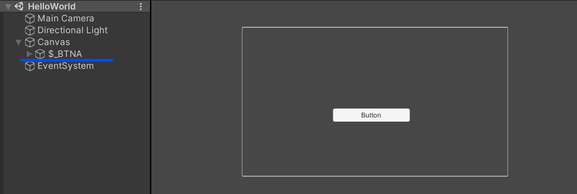
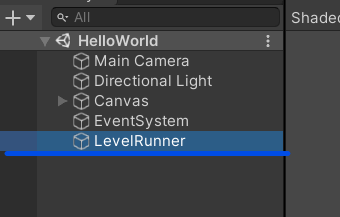
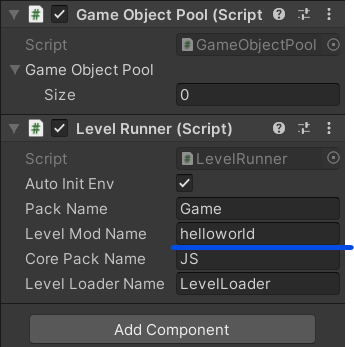
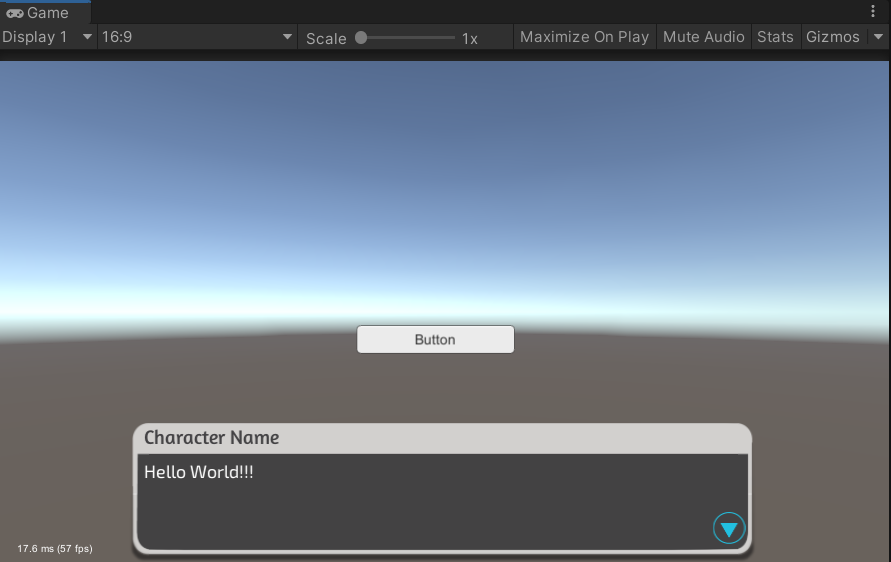

# 基础

## 准备工作

Unity版本： 2020.3 或以上

需要的其他开发环境：

**node.js**，请根据自身网络环境选择下载方式

[Download | Node.js (nodejs.org)](https://nodejs.org/en/download/)

[下载 | Node.js 中文网 (nodejs.cn)](http://nodejs.cn/download/)

如果是中国用户，推荐设置  cnpm

> 可以使用 [cnpm](https://github.com/cnpm/cnpm) (gzip 压缩支持) 命令行工具代替默认的 `npm`:
>
> ```
> $ npm install -g cnpm --registry=https://registry.npm.taobao.org
> ```

还需要安装**typescript**

```shell
npm install -g typescript

# or

cnpm install -g typescript
```

我们使用**VScode**来编码，所以需要设置Unity的编码工具为Vscode，然后打开项目





## 下载并解压

在release页面下载版本并解压

[Releases · Fungus-Light/Black-Rabbit-Pro (github.com)](https://github.com/Fungus-Light/Black-Rabbit-Pro/releases)

使用Unity打开里面的**BlackRabbitPro**项目文件夹



## 重要的文件夹

有两个重要文件夹：**TsProject**和**GameScript**

TsProject是框架使用的，如果不增加框架内容可以不管

GameScript是具体关卡的逻辑代码，一般只关心这个即可

**PS:** 这个划分不是必须的，但是是推荐的，理论上完全可以把所有逻辑全都放在TsProject里，但是为了区分框架和逻辑，故这样划分。

- **创建新关卡脚本**

vscode集成终端进入到GameScript文件夹，通过命令

```bash
npm run Create:Level 关卡名
```

来创建关卡脚本。



已经存在的关卡名不会被创建

## 关卡脚本结构

```javascript
class Scene1 implements IGameLevel {
    name: string;
    root: Transform;
    OnStart(): void {
        Debug.LogWarning("Level Scene1 Start!!!")
    }
    OnUpdate(): void {

    }
    OnFixedUpdate(): void {

    }
    OnDestroy(): void {

    }

}
```

每个关卡都是这样结构

各个函数分别对应Unity的生命周期

一般都是在OnStart()里面编写配置逻辑，在Update()里编写循环逻辑等

## 常见的api

在GameScript/@types 文件夹里面有定义文件**api.d.ts**

在TsProject文件夹里面运行命令  **npm run build**,就会重新生成框架代码

最重要的是以 **$** 开头的一系列函数

这些函数能够查询到以   **$_**   开头命名的物体

比如我在场景里面有一个物体叫 **$_Cube**

那么我使用

```javascript
let cube = $("Cube")  
```

就能获取到 **$_Cube** 物体的Transform组件

例如我有一个 按钮 叫 **$_BTNA**

那么我使用

```javascript
let BTNA = $Button("BTNA")  
```

就可以获取到这个按钮组件

Button类型是特殊封装过的

所以可以使用

```javascript
BTNA.RegClickCallBack("startgame", () => {
    //To do
})
```

来注册点击事件，第一个参数是标签，用于标注这个行为，第二个是  ()=>{ } 匿名/箭头函数 ，对应c#的Action

我们在匿名函数里写点击后如何执行

！！！！在编辑场景时，选中一个物体，使用快捷键 **ctrl + alt + n**  可以快捷添加 **$_** 前缀

## Hello World

我们将使用对话系统来说出 **“Hello World”**

首先我们新建一个空白场景，添加一个按钮，按钮名字为 **$_BTNA**



对话模块核心是**CreateDialog()** 函数，

这个函数将会创建一个**DialogManager**对话管理器对象，例如

```javascript
let HelloWorld = CreateDialog()
```

或者可以采用简写

```javascript
let HelloWorld = $Block()
```

这个对象有以下一些函数

```javascript
HelloWorld.Say("Hello World")
HelloWorld.SetCallBack(() => {
    //当整个对话结束后调用
    Debug.Log("Dialog End")  //Debug Vector3 等常用类可以直接使用
})
HelloWorld.WaitForFrames(60) //等待若干帧
HelloWorld.WaitForSeconds(1) //等待若干秒，受游戏速度影响
HelloWorld.WaitForSecondsUnscaled(2) //等待若干秒，不受游戏速度影响
HelloWorld.DoAction(() => {
    //在对话进行过程中执行操作
    Debug.Log("XXXXXXX")
})
HelloWorld.Options([ //第一个参数是 option 对象的数组
    option("选项1", () => {
        HelloWorld.Continue()//继续执行，在暂停对话后用来恢复对话
    }),
    option("选项2", () => {
        Option2Dialog.Start()
    })
], true)//这里参数是指是否暂停后面的语句
HelloWorld.Say("这是  HelloWorld.Continue()  执行后才会运行的语句")
```

我们可以采用链式调用写法来简化

```javascript
HelloWorld.SetCallBack(() => {
    //当整个对话结束后调用
    Debug.Log("Dialog End")  //Debug Vector3 等常用类可以直接使用
})
HelloWorld.Say("Hello World")
    .WaitForFrames(60) //等待若干帧
    .WaitForSeconds(1) //等待若干秒，受游戏速度影响
    .WaitForSecondsUnscaled(2) //等待若干秒，不受游戏速度影响
    .DoAction(() => {
        //在对话进行过程中执行操作
        Debug.Log("XXXXXXX")
    })
    .Options([ //第一个参数是 option 对象的数组
        option("选项1", () => {
            HelloWorld.Continue()//继续执行，在暂停对话后用来恢复对话
        }),
        option("选项2", () => {
            Option2Dialog.Start()
        })
    ], true)//这里参数是指是否暂停后面的语句
    .Say("这是  HelloWorld.Continue()  执行后才会运行的语句")
```

这些只是定义了整个对话的流程，而且我们的对话很简洁，在OnStart方法里，我们写如下代码，VSCode一般会自动补全模块的import

```javascript
let SayHello = $Block()
SayHello.Say("Hello World!!!");
```

但是对话还没有开始，我们首先要获取到按钮，所以输入

```javascript
let BTNA =$Button("BTNA")
```

接着在按钮点击里面

```javascript
BTNA.RegClickCallBack("startgame", () => {
    BTNA.RegClickCallBack("click",()=>{
        SayHello.Start()
    })//Start()是从头开始的意思
})
```

完整的代码如下：

```javascript
/*================Dont Delete This=========================*/
import { $Block } from "JS/Dialog/DialogManager";
import { IGameLevel } from "JS/Interface/IGameLevel";
import { $Button } from "JS/UI/UI";
import { Debug, Transform , $ } from "JS/Utils/Common"

function Create() { return new helloworld(); }
export { Create }

/*=========================================================*/

class helloworld implements IGameLevel {
    name: string;
    root: Transform;
    OnStart(): void {
        Debug.LogWarning("Level helloworld Start!!!")
        let SayHello = $Block()
        SayHello.Say("Hello World!!!");
        let BTNA =$Button("BTNA")
        BTNA.RegClickCallBack("click",()=>{
            SayHello.Start()
        })
    }
    OnUpdate(): void {

    }
    OnFixedUpdate(): void {

    }
    OnDestroy(): void {

    }

}
```

---

代码编写完后，在终端里

输入**npm run build**

这会编译ts代码并复制到Unity项目里面

然后我们来看Unity实际场景如何使用脚本

我们在场景里新建一个空物体，你可以选择任意命名，这里我取名为**LevelRunner**



然后我们选择它，使用快捷键**ctrl+alt+i** ,就可以快速将其初始化为关卡管理器

LevelRunner需要配置关卡模块名 为之前脚本名称



然后运行场景，点击按钮


