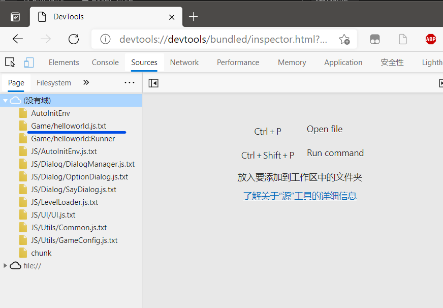

# 调试

> 当前调试模式还不够完美，但已经可以使用了，可以满足大部分情况

为了更好的排查错误，我们可以采用chromium内核的浏览器来调试，例如**断点调试、热重载等**

## 开启调试模式

首先找到这个**DebugConfig** 预制体，


在右侧监视窗口，打开**Is Debug Mode** 一项


这样就开启了调试模式

**注意：调试模式下一定要等待调试器连接后，才会进一步执行代码，请注意！！！如果不需要调试了，请及时关闭调试模式。**

## 打开调试器

这里以新版edge浏览器为例

在地址栏输入：

```bash
devtools://devtools/bundled/inspector.html?v8only=true&ws=127.0.0.1:4396
```

你可以在**DebugConfig** 预制体里设置自己的调试端口

只需要把上面地址的最后的端口号设置为自己的端口号


## 设置要调试的脚本

首先创建一个调试模块配置文件

如下图：


我们以自带的为例

在检视窗口将**helloworld** 添加到列表里


将其指派给**DebugConfig**预制体


## 预加载（第一次连接）

调试器网页中选择Sources一栏。

我们在**HelloWorld**场景启动游戏，游戏会暂停，等待调试器链接。

我们刷新调试器的网页，（可能要刷新两次），直到出现以下页面



选择**Game/helloworld.js.txt** 文件，打上断点


## 正式调试（第二次连接）

unity重新播放游戏

刷新调试器，重新连接，就会停在断点处


