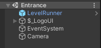

# 游戏结构

在开始制作关卡之前，我们需要了解游戏的基本结构。

## 入口

为了便于拓展，**Black-Rabbit-Pro** 采用了，统一入口 + 配置文件 + 游戏包 的结构。
入口场景位于，**Assets/BlackRabbitPro/Scenes/Entrance.unity**



**LevelRunner** 物体运行了一个 **GameEntrance** 的模块，这个模块的源代码可以在

**TsProject/JS/GameEntrance.ts** 找到

这个模块会自动添加所有关卡必要的环境，并且加载配置文件中指定的游戏包，从游戏包里读取入口场景。

这些信息都储存在json文件中，当然，大部分文件都是自动生成的。

## 游戏包

任何一个使用 **Black-Rabbit-Pro** 开发的游戏都可以分成若干 **游戏包** 。
游戏包是一个 **AssetBundle** 文件，里面包含了若干个场景，同时有一个统一的json文件记录了全部游戏包的信息，包括每个包里全部的场景，每个包的入口场景。
```json
[
    {
        "name": "example",
        "entrance": "dialogmod",
        "levels": [
            "dialogmod",
            "features"
        ]
    }
]
```
以这个示例文件

**Assets/StreamingAssets/GamePacks.json**来看，

全部的游戏包存储在一个数组里，这个数组里目前只有一个包

这个包名叫 **example** ，里面有两个场景，分别是 **dialogmod** 和 **features**，同时当加载这个包的时候，会首先加载 **dialogmod** 。

---

为了创建游戏包，所有的游戏包都应该创建在，

**Assets/Games** 这一个文件夹下，例如 **Assets/Games/Example** （不分大小写）这个文件夹下的场景将会生成游戏包 **example** 。

目前所有属于游戏包的场景需要平级地放在其游戏包目录下，暂时不支持子目录。

## 配置游戏设置

为了提高可定制程度，在加载时，会读取 **StreamingAssets** 文件夹下的 **GameConfig.json** 文件，你可以在发布时添加自己的启动器。


## 配置关卡信息